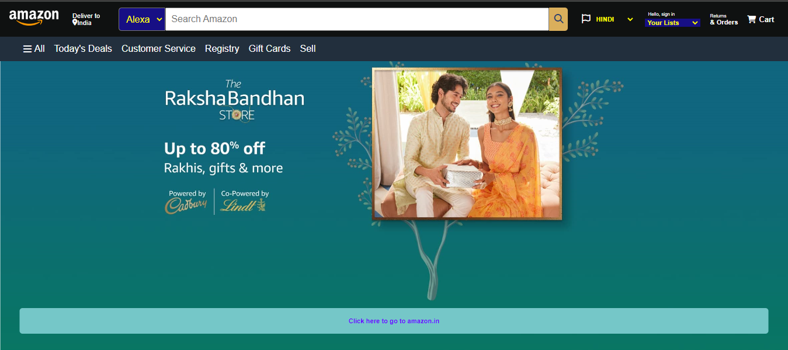
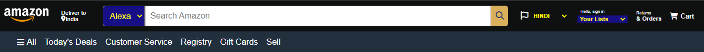
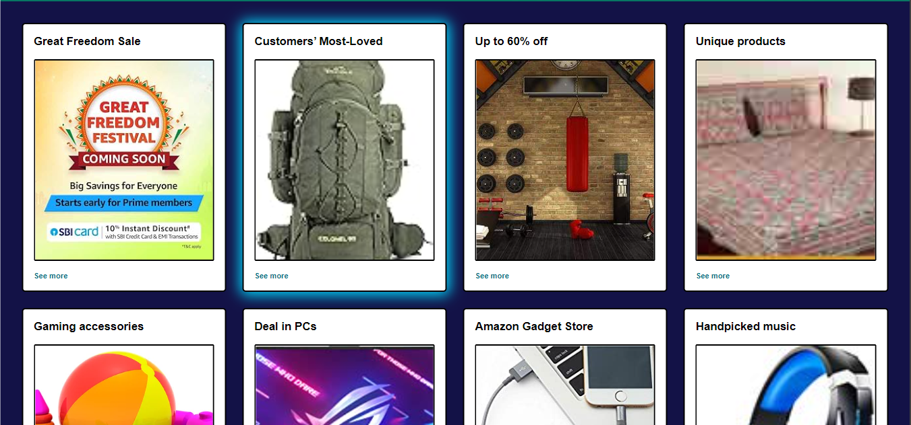
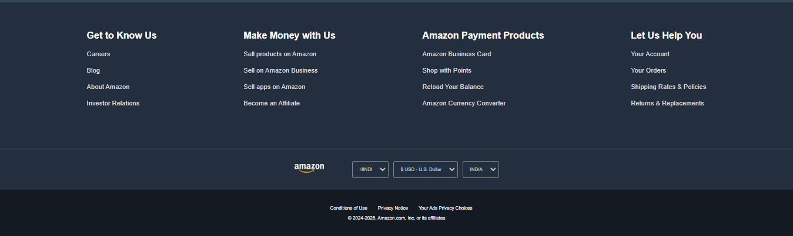

## 🌏 Wanderlust



---

<div>
  <h2> Overview</h2>
</div>

A clone of Amazon's e-commerce website built using HTML and CSS.

---

<div>
  <h2>Table of Contents</h2>
</div>

---
- [📑 Features](#-features)
- [🔧 Technologies](#-technologies)
- [⚙️ Installation](#-installation)
- [📸 Screenshots](#-screenshots)
- [🤝 Contributing](#-contributing)
- [📜 License](#-license)
- [📞 Contact](#-contact)

---

## 📑 Features

- Responsive design
- Shoping Cards

---

## 🔧 Technologies

### Front-end
- **HTML**: displayed in a web browser.
- **Design:** Responsive layout with CSS Flexbox
- **Icons:** Font Awesome

---

## ⚙️ Installation

1. **Clone the repository**
    ```bash
    git clone https://github.com/yourusername/Amazon_Clone.git
    cd Amazon_Clone
    ```

---

## 📸 Screenshots


*Homepage*


*Header*


*Cards*


*Footer*

---

## 🤝 Contributing

Contributions are welcome! Please fork the repository and create a pull request with your changes. Ensure your code follows the project's coding standards and include relevant tests.

1. Fork the repository
2. Create your feature branch
    ```bash
    git checkout -b feature/YourFeature
    ```
3. Commit your changes
    ```bash
    git commit -m 'Add YourFeature'
    ```
4. Push to the branch
    ```bash
    git push origin feature/YourFeature
    ```
5. Open a pull request

---

## 📜 License

This project is licensed under the MIT License. See the [LICENSE](LICENSE) file for details.

---

## 📞 Contact

For any questions or suggestions, please reach out to:

- **Name**: Balram
- **Email**: balramapply123@gmail.com
- **GitHub**: [yourusername](https://github.com/BalramApply)

---
# Amazon_Clone
